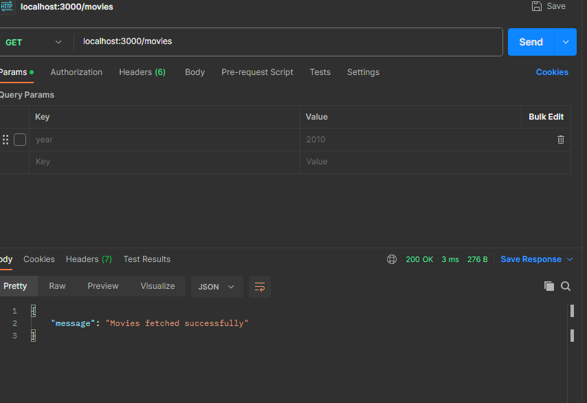
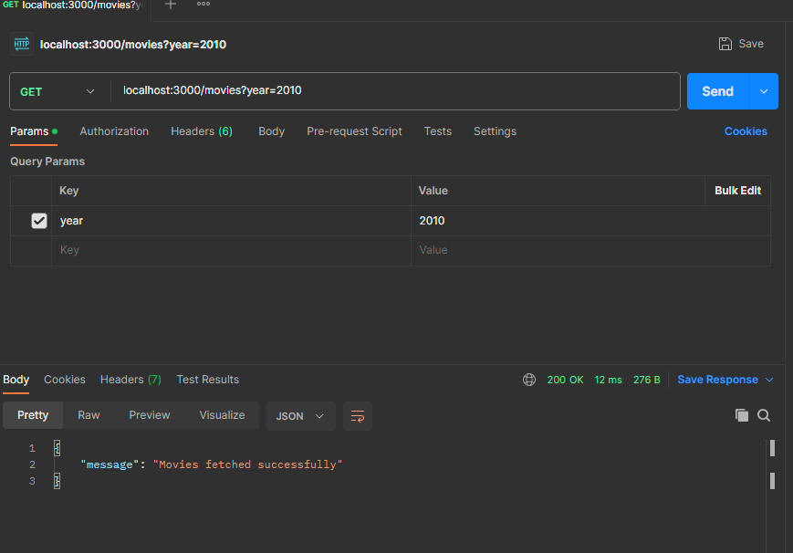
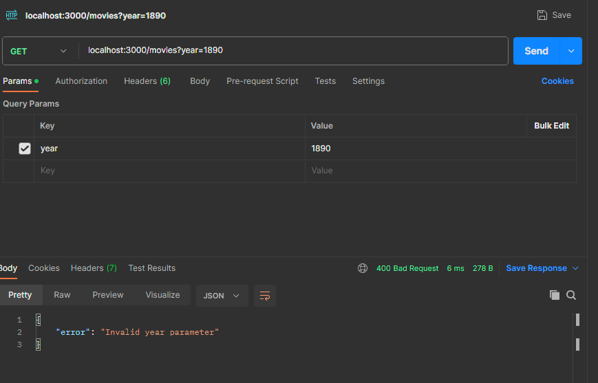

### create an api endpoint using express to get movies from netflix catalog
- no need to implement the service layer - we are interested only to check you knowledge in creating the express basic controller and routes structure

### validate that year of the movie is sent in the request as a parameter 
the validation cannot be in the controller and return right response to user

### create a middleware to validate errors

Testing results:
Req without year

Req with valid year

Req with invalid year 

